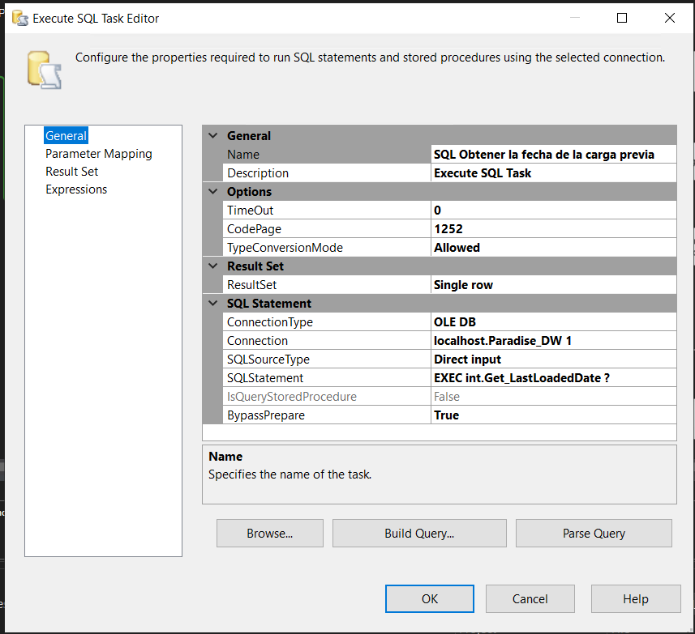
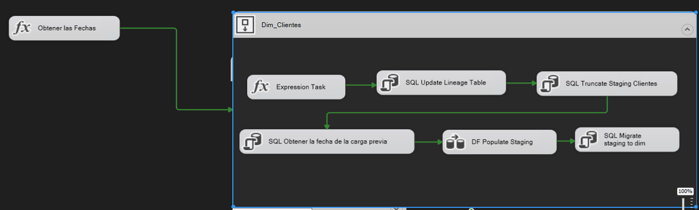
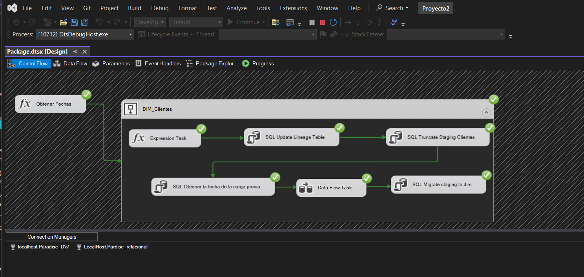
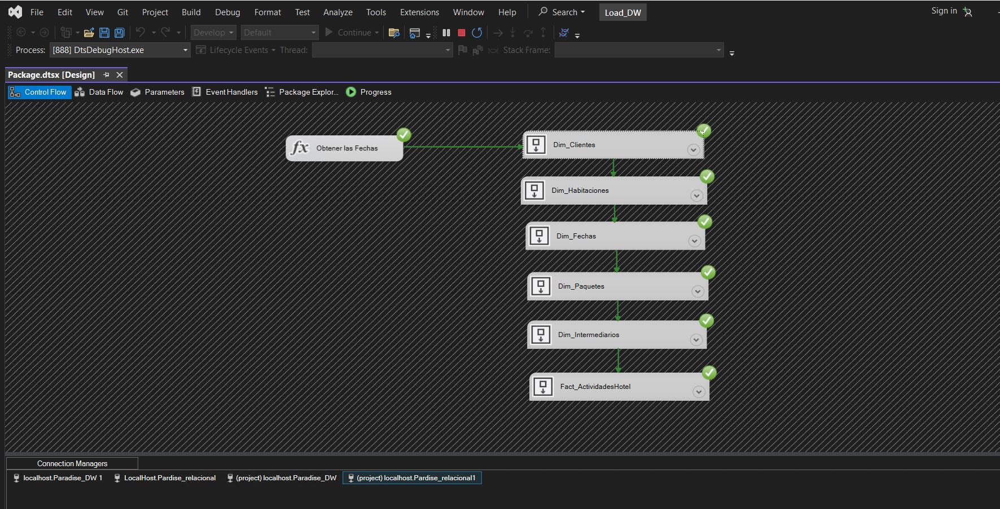

# ETL-Hotel-Paradise


### SQL Server Integración Services (SSIS) es un componente de Microsoft SQL Server utilizado principalmente para la integración de datos que incluyen la extracción, transformación y carga de datos (ETL).SSIS ayuda a automatizar el flujo de trabajo en diversos procesos de gestión de datos.

<h1 style="text-align: center;">ETL Hotel Playa Paradise 🏖️</h1>


## El siguiente proyecto fue realizado utilizando las siguientes Herramientas / tecnologias:
- SQL Server
- Visual estudio 2022
- Herramienta SSIS 
- Mackaroo para la generacion de datos aleatorios

###

### Parte Uno: Creacion y Generacion BD Relacional


Para comenzar, configuraremos la base de datos relacional creando el esquema [int] para las siguientes tablas:


```sql
	CREATE SCHEMA [int]
	AUTHORIZATION [dbo];

- [int].Linage

CREATE TABLE [int].[Lineage] (
    [LineageKey]     INT            IDENTITY (1, 1) NOT NULL,
    [TableName]      NVARCHAR (200) NOT NULL,
    [StartLoad]      DATETIME       NOT NULL,
    [FinishLoad]     DATETIME       NULL,
    [LastLoadedDate] DATETIME       NOT NULL,
    [Status]         NVARCHAR (1)   CONSTRAINT [DF_Lineage_Status] DEFAULT (N'P') NOT NULL,
    [Type]           NVARCHAR (1)   CONSTRAINT [DF_Lineage_Type] DEFAULT (N'F') NOT NULL,
    CONSTRAINT [PK_Integration_Lineage] PRIMARY KEY CLUSTERED ([LineageKey] ASC)
);


- [int].IncrementalLoads
  
  	CREATE TABLE [int].[IncrementalLoads] (
    [LoadDateKey] INT            IDENTITY (1, 1) NOT NULL,
    [TableName]   NVARCHAR (100) NOT NULL,
    [LoadDate]    DATETIME       NOT NULL,
    CONSTRAINT [PK_LoadDates] PRIMARY KEY CLUSTERED ([LoadDateKey] ASC)
);
```

Estas tablas son esenciales para mantener el control y seguimiento de los procesos ETL dentro de un Data Warehouse. Ayudan a garantizar que los datos se cargan de manera precisa y eficiente, permiten la auditoría de las cargas y facilitan la resolución de problemas que puedan surgir durante los procesos de carga.

Utilizando el gestor de bases de datos SQL Server, el primer paso será crear nuestra base de datos relacional. A estas tablas les añadiremos el atributo **ModifiedDate datetime default '2022-01-01'**, el cual nos ayudará a tener un registro de cuándo fueron creadas. Llenaremos estas tablas con datos aleatorios según los atributos necesarios.

Para generar estos datos, utilizaremos la herramienta Mockaroo, proporcionándole los atributos de cada una de las tablas relacionales. Una vez obtenidos y generados los datos para cada una de las tablas en formato XML, los guardaremos en una carpeta específica.

***Creacion procedimientos almacenados Staging***

Luego, crearemos procedimientos almacenados solo para las tablas que utilizaremos para crear las dimensiones. Estos procedimientos nos ayudarán a unir tablas para conformar nuevas tablas que se convertirán en dimensiones en nuestro DataWarhouse.

La staging area (o área de preparación) es una parte crítica del proceso ETL (Extracción, Transformación y Carga) en un Data Warehouse. Su propósito es almacenar temporalmente los datos que se están extrayendo de las fuentes de datos antes de ser transformados y cargados en las tablas finales del Data Warehouse.

***Ejemplo de Staging para la tabla Clientes***

```sql 
Create   PROCEDURE [dbo].[Load_StagingCliente]
    @LastLoadDate DATETIME,
    @NewLoadDate DATETIME
AS
BEGIN
    SET NOCOUNT ON;
    SET XACT_ABORT ON;

    SELECT 
        'XML|' + CONVERT(NVARCHAR, C.Cliente_ID) AS [_Source Key],
        CONVERT(NVARCHAR(100), C.Nombre) AS [Nombre Cliente],
        CONVERT(NVARCHAR(100), C.Apellido) AS [Apellido Cliente],
        CONVERT(NVARCHAR(100), C.Nacionalidad) AS [Nacionalidad],
        CONVERT(NVARCHAR(100), C.Tipo_Cliente) AS [Tipo Cliente],
		CONVERT(NVARCHAR(100), C.Metodo_Reserva) AS [Metodo Reservacion],
        CONVERT(DATETIME, ISNULL(C.ModifiedDate, '1753-01-01')) AS [Valid From],
        CONVERT(DATETIME, '9999-12-31') AS [Valid To]
    FROM 
        Clientes AS C

    WHERE 
        C.ModifiedDate > @LastLoadDate AND C.ModifiedDate <= @NewLoadDate;

    RETURN 0;
END;
```

***Procedimiento Almacenado para la Fact Table***
```sql
ALTER PROCEDURE [dbo].[Load_StagingActividadesHotel]
    @LastLoadDate DATETIME,
    @NewLoadDate DATETIME
AS
BEGIN
    SET NOCOUNT ON;
    SET XACT_ABORT ON;

    SELECT 
        R.Reservaciones_ID AS [_Source Reservacion Key], 
        C.Cliente_ID AS [_Source Cliente Key],  
        P.Paquete_ID AS [_Source Paquete Key],
        H.Habitaciones_ID AS [_Source Habitacion Key],
        I.Intermediario_ID AS [_Source Intermediario Key], 
        F.Fecha_ID AS [_Source Fecha Key],
        CAST(CI.Fecha_check_in AS DATETIME) AS [Fecha Check-in],
        CAST(CI.Fecha_check_out AS DATETIME) AS [Fecha Check-out],
        H.Precio_noche AS [Precio Noche],
        P.Precio AS [Precio Paquete],
        DATEDIFF(DAY, CI.Fecha_check_in, CI.Fecha_check_out) AS [Dias de Ocupacion],
        R.Metodo_Pago AS [Metodo de Pago],
        CAST(R.ModifiedDate AS DATETIME) AS [Modified Date]
    FROM 
        Reservaciones AS R
    INNER JOIN 
        Clientes AS C ON C.Cliente_ID = R.Cliente_ID
    INNER JOIN 
        Habitaciones AS H ON H.Habitaciones_ID = R.Habitacion_ID
    INNER JOIN 
        Paquetes AS P ON P.Paquete_ID = R.Paquete_ID
    INNER JOIN 
        Intermediarios AS I ON I.Intermediario_ID = R.Intermediario_ID
    INNER JOIN 
        Fecha AS F ON F.Fecha_ID = R.Fecha_ID
    INNER JOIN 
        Check_in_out AS CI ON CI.Cliente_ID = R.Cliente_ID 
    WHERE 
        (R.ModifiedDate > @LastLoadDate AND R.ModifiedDate <= @NewLoadDate) or
        (P.ModifiedDate > @LastLoadDate AND P.ModifiedDate <= @NewLoadDate) AND
        CI.Fecha_check_out >= CI.Fecha_check_in;

    RETURN 0;
END;
```

### Parte Dos:  Data Warehouse 
Para comenzar, configuraremos la base de datos ( Data Warehouse) creando el esquema [int] para las siguientes tablas:

```sql
	CREATE SCHEMA [int]
	AUTHORIZATION [dbo];

- [int].Linage

CREATE TABLE [int].[Lineage] (
    [LineageKey]     INT            IDENTITY (1, 1) NOT NULL,
    [TableName]      NVARCHAR (200) NOT NULL,
    [StartLoad]      DATETIME       NOT NULL,
    [FinishLoad]     DATETIME       NULL,
    [LastLoadedDate] DATETIME       NOT NULL,
    [Status]         NVARCHAR (1)   CONSTRAINT [DF_Lineage_Status] DEFAULT (N'P') NOT NULL,
    [Type]           NVARCHAR (1)   CONSTRAINT [DF_Lineage_Type] DEFAULT (N'F') NOT NULL,
    CONSTRAINT [PK_Integration_Lineage] PRIMARY KEY CLUSTERED ([LineageKey] ASC)
);


- [int].IncrementalLoads
  
  	CREATE TABLE [int].[IncrementalLoads] (
    [LoadDateKey] INT            IDENTITY (1, 1) NOT NULL,
    [TableName]   NVARCHAR (100) NOT NULL,
    [LoadDate]    DATETIME       NOT NULL,
    CONSTRAINT [PK_LoadDates] PRIMARY KEY CLUSTERED ([LoadDateKey] ASC)
);
```

Para empezar, realizaremos la creación de las tablas Dim (prefijo de las dimensiones, ejm: Dim_Clientes), las cuales tendrán los atributos que hayas establecido anteriormente en los procedimientos almacenados, con algunos cambios. Seran agregados [_Source Key], y añadiremos los atributos [Linage key] de tipo int, [Valid from] y [Valid to], ambos de tipo date.

 En un Data Warehouse, las tablas de dimensión son utilizadas para almacenar los atributos descriptivos relacionados con las entidades del negocio que queremos analizar.

  La tabla incluye un campo lineage key que se utiliza para rastrear el origen y la historia de los datos a medida que se mueven y transforman a través del proceso ETL (Extract, Transform, Load). Esto ayuda en la auditoría y en la gestión del ciclo de vida de los datos.

```sql
CREATE TABLE Dim_Cliente (
    [Clientes ID] INT PRIMARY KEY IDENTITY (1,1),
	[_Source key] nvarchar (50), 
    [Nombre Clientes] nVARCHAR(255),
    [Apellidos Clientes] nVARCHAR(255),
    [ Nacionalidad ] nVARCHAR(255),
    [Tipo Cliente] nVARCHAR(255),
    [Metodo Reservacion]  nVARCHAR(255),
	[lineage key] int not null,
	[Valid from] datetime , 
	[Valid to] datetime 
);
```

También crearemos las tablas Staging (prefijo, ejm: Staging_Clientes), que básicamente son una copia de las Dim a las cuales solo les quitaremos el atributo [Linage key]. Una vez hechas las tablas Dim y Staging, crearemos la Fact_Table, la cual también tendrá su tabla Staging, siguiendo las mismas especificaciones anteriores.

La tabla Staging_Cliente sirve como un almacenamiento intermedio para los datos extraídos de las fuentes originales. Este almacenamiento temporal permite realizar transformaciones y limpiezas de datos antes de moverlos a las tablas finales del Data Warehouse.

```sql
CREATE TABLE Staging_Cliente (
    [Clientes ID] INT PRIMARY KEY identity(1,1) NOT NULL,
	[_Source key] nvarchar (50),
    [Nombre Clientes] nVARCHAR(255),
    [Apellidos Clientes] nVARCHAR(255),
    [ Nacionalidad ] nVARCHAR(255),
    [Tipo Cliente] nVARCHAR(255),
    [Metodo Reservacion]  nVARCHAR(255),
	[Valid from] datetime , 
	[Valid to] datetime
);
```

### Creacion de los Procedimientos Almacenados Load

Los procedimientos Load se encargarán de recibir los datos de la base de datos relacional y registrarlos tanto en las tablas Staging como en las tablas Dim.

El procedimiento almacenado [dbo].[Load_DimCliente] se utiliza para cargar y actualizar datos en la tabla Dim_Cliente a partir de la tabla de etapa Staging_Cliente. Esto es parte de un proceso ETL (Extracción, Transformación y Carga) en un  Data Warehouse.

El procedimiento almacenado Load_DimCliente se utiliza para cargar datos desde la tabla de staging Staging_Cliente a la tabla de dimensión Dim_Cliente en el Data Warehouse

```sql
Create PROCEDURE [dbo].[Load_DimCliente]
AS
BEGIN
    SET NOCOUNT ON;
    SET XACT_ABORT ON;

    DECLARE @EndOfTime datetime = '9999-12-31';
    DECLARE @LastDateLoaded datetime;

    BEGIN TRAN;

    DECLARE @LineageKey int = (SELECT TOP(1) [LineageKey]
                               FROM int.Lineage
                               WHERE [TableName] = N'Dim_Cliente'
                               AND [FinishLoad] IS NULL
                               ORDER BY [LineageKey] DESC);

    UPDATE initial
    SET initial.[Valid To] = modif.[Valid From]
    FROM 
        Dim_Cliente AS initial INNER JOIN 
        Staging_Cliente AS modif ON initial.[_Source Key] = modif.[_Source Key]
    WHERE initial.[Valid To] = @EndOfTime;

    IF NOT EXISTS (SELECT 1 FROM Dim_Cliente WHERE [_Source Key] = '')
	INSERT INTO Dim_Cliente
		([_Source Key], [Nombre Clientes], [Apellidos Clientes], [ Nacionalidad ], [Tipo Cliente], 
		 [Metodo Reservacion], [Valid From], [Valid To], [Lineage Key])
	VALUES 
		('', 'Unknown', 'Unknown', 'Unknown', 'Unknown', 
		 'Unknown', '1753-01-01', '9999-12-31', -1);


    INSERT Dim_Cliente
           ([_Source Key], [Nombre Clientes], [Apellidos Clientes], [ Nacionalidad ], [Tipo Cliente], 
			[Metodo Reservacion], [Valid From], [Valid To], [Lineage Key])
    SELECT  [_Source Key], [Nombre Clientes], [Apellidos Clientes], [ Nacionalidad ], [Tipo Cliente], 
			[Metodo Reservacion], [Valid From], [Valid To], @LineageKey
    FROM Staging_Cliente;

    UPDATE [int].Lineage
        SET 
            FinishLoad = SYSDATETIME(),
            Status = 'S',
            @LastDateLoaded = LastLoadedDate
    WHERE [LineageKey] = @LineageKey;

    UPDATE [int].[IncrementalLoads]
        SET [LoadDate] = @LastDateLoaded
    WHERE [TableName] = N'Dim_Cliente';

    COMMIT;

    RETURN 0;
END;
```

El procedimiento almacenado Load_DimCliente es fundamental en el proceso ETL para asegurar que los datos en la tabla de dimensión Dim_Cliente estén actualizados y sean precisos. Gestiona la validez temporal de los registros, inserta datos nuevos y modificados, y proporciona un mecanismo de auditoría y control mediante las tablas Lineage e IncrementalLoads. Esto asegura que el Data Warehouse mantenga datos de alta calidad para análisis y toma de decisiones.

###  Parte Tres: Inserción de Datos desde Visual Studio

En esta sección, abordaremos la inserción de datos en nuestras tablas Dim y Staging utilizando Visual Studio. 

Crearemos una conexión con la base de datos en el **Solution Explorer / Connection Manager/ New Connection** y seleccionaremos como tipo de conexion "SQL Autentification" luego facilitaremos nuestro nombre de servidor y el nombre de la base de datos que estamos ocupando.

Iniciamos creando un proyecto de tipo SSIS para la insercion de datos a nuestra base de datos relacional.

Comenzamos con una "Data Flow Task" que podremos encontrar en la tool bars en la parte izquierda, renombramos nuestro data flow y clicleamos dos veces para a continuacion  utilizar un xml source y en él cargaremos los archivos xml que anteriormente habiamos creados con mackaroo una vez hecho eso generaremos un archivo XMS y escogeneremos el lugar donde queremos que se guarden estos archivos.

Luego utilizaremos un "Data Conversation" donde el Xml source estara unido a este, en el seleccionaremos las columnas que ocuparemos y mejoraremos detalles sin es necesario como lo son el nombre del atributo, el atributo y longitud.

Arrastraremos un OLDB Destination y en él escogermos la tabla de la base de datos a la cual llenaremos con los datos del archivo xml y en el menu Mapping sincronizaremos las columnas del xml y las columnas de la tabla.Para terminar uniremos el Data Tranformation con el OLDB Destination y ejecutaremos, seguiremos estas acciones con todos los archivos XML.


### Parte Cuatro: Carga de datos al  Data Warehouse
 Comenzaremos creando otro proyecto de tipo SSIS y creando otra conexión pero esta vez para el  Data Warehouse como lo hicimos anteriormente.

En este proyecto crearemos variables que eventualmente estaremos usando daremos click derecho en un espacio vacio,las variables serian las siguientes:


- LoadType
- TableName
- LoadDate
- PreviuosLoadDate
- LinageKey

Arrastraremos un SQL Task y lo configuraremos como se muestra a continuación:


***Cada vez que terminemos un componente lo uniremos con el siguiente mediante la flecha verde***

Seleccionaremos otro SQL Task y lo configuraremos de esta manera:


En el menu de **Mapping** asignaremos las variables LoadType (nvarchar), tableName (nvarchar) y LoadDate (datetime), en el menu Result set, LinageKey  a la cual le asignaremos un valor de 0.


Como tercer componente utilizaremos un **Expression Task** donde lo configuraremos de la siguiente variable:


Para el cuarto compente utilizaremos otro SQL Task en el cual obtendremos la fecha de modificacion y debera quedar de la siguiente manera:



En el menu de Mapping solo agregaremos la variable TableName de tipo nvarchar y en Result Set agregaremos un elemento al cual le asignaremos un valor de 0 y la almacenara la variable PreviousLoadDate .

El quinto componente sera un **Data Flow Task**, en este punto tendremos que agregar otros dos elementos un **ODB Source** y un **OLE DB Destination**

En la configuraion del **ODB Source** escogeremos la conexión de la base de datos relacional y en **Data access mode** seleccionaremos la opcion "Table or view - fast load" en **Name of the table or the view** escogeremos la respectiba tabla que ocuparemos, en el menu "Columns" se sincronizaran automaticamente.

Luego en **Data access mode** escogeremos "SQL Command" debera quedar de la siguiente manera: (esto cambiara deacuerdo a la tabla que estemos ocupando)


Agregaremos 2 parametros en la opcion de los parametros:
- @LastLoadDate la cual sera almacenada en la variable PreviousLoadDate, que tu seleccionaras en la siguiente columna.
- @NewLoadDate la cual sera almacenada en la variable LoadDate, que tu seleccionaras en la siguiente columna.

La configuracion del **OLE DB Destination** sera un poco mas simple ya que solo seleccionaremos la conexión al DataWarhouse y escogeremos la tabla Staging de la tabla que estemos trabajando, en este caso deberas sincronizar los mapping.

Luego regresamos a la pestaña **Control Flow** para seguir con la secuencia de los componentes.

Como ultimo componente agregaremos un SQL Task debera quedar de la siguiente manera:


Para terminar con el proceso agregaremos dos componentes mas de la toolbox estos serian un **Expression Task y un Sequence Container**.

Configura el **Expression Task** de esta manera:


Añadiremos todos los componentes anteriores al **Sequence Container** exceptuando el Ultimo **Expression Task** como se muestra en la siguiente imagen.



Luego ejecutaremos el proyecto y si todo salio bien debera quedar de la siguiente manera.



Repetiremos esto para todas las dimensiones que estemos ocupando en nuestra DataWarehouse


